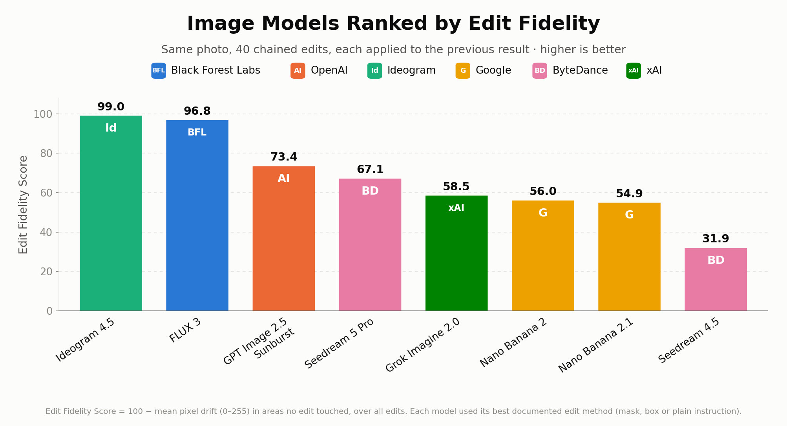
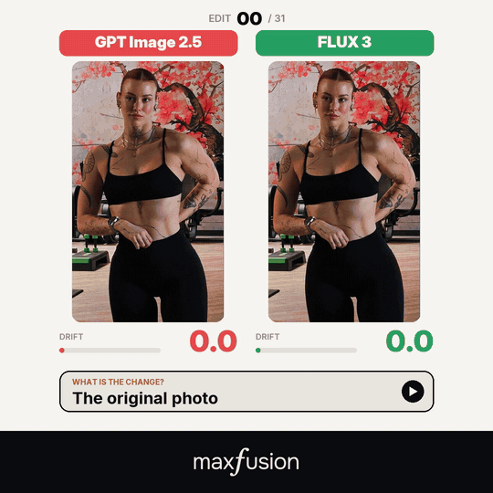
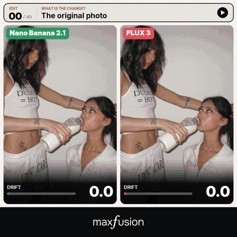
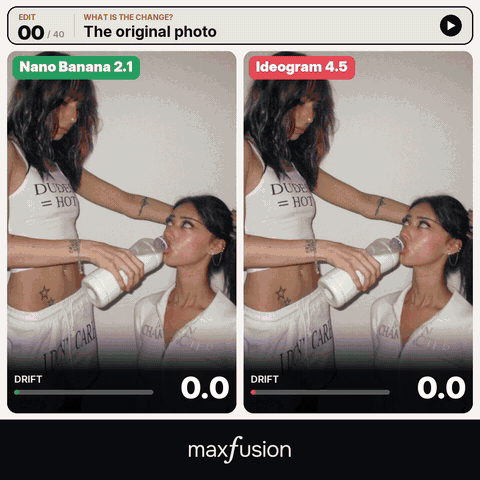
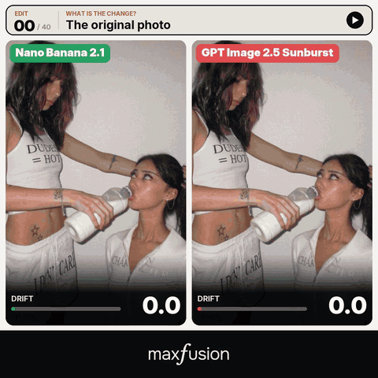
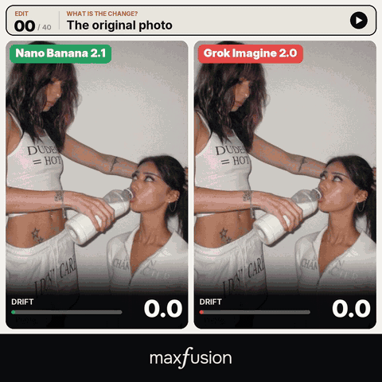
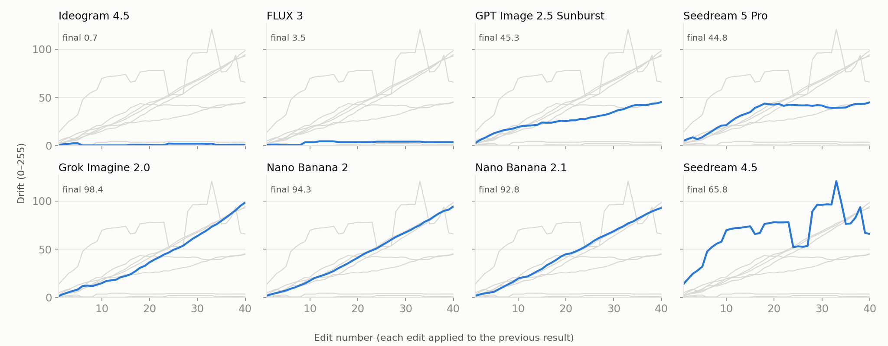

# Edit Drift

**How much does an image model change what you told it to leave alone?**



| Rank | Model | Vendor | Method | Edit Fidelity Score ↑ | Mean drift ↓ | Final drift ↓ | Drift / edit |
|---|---|---|---|---|---|---|---|
| 1 | Ideogram 4.5 | Ideogram | mask edit (high precision) | **99.0** | 1.0 | 0.7 | 0.01 |
| 2 | FLUX 3 | Black Forest Labs | box edit | **96.8** | 3.2 | 3.5 | 0.07 |
| 3 | GPT Image 2.5 Sunburst | OpenAI | mask edit | **73.4** | 26.6 | 45.3 | 0.95 |
| 4 | Seedream 5 Pro | ByteDance | plain instruction | **67.1** | 32.9 | 44.8 | 0.94 |
| 5 | Grok Imagine 2.0 | xAI | plain instruction | **58.5** | 41.5 | 98.4 | 2.45 |
| 6 | Nano Banana 2 | Google | plain instruction | **56.0** | 44.0 | 94.3 | 2.46 |
| 7 | Nano Banana 2.1 | Google | plain instruction | **54.9** | 45.1 | 92.8 | 2.46 |
| 8 | Seedream 4.5 | ByteDance | plain instruction | **31.9** | 68.1 | 65.8 | 1.41 |

*Milk benchmark, October 2026. Qwen Image 3, GPT Image 2 and GPT Image 2.5 Flare are still running and will be added.*

## See it

The test that started it: 40 chained edits, GPT Image 2.5 vs FLUX 3.



Nano Banana 2.1 against the field, same photo, same 40 edits:

<!-- GIFS:START -->
| vs FLUX 3 | vs Ideogram 4.5 |
|---|---|
|  |  |
| **vs GPT Image 2.5 Sunburst** | **vs Grok Imagine 2.0** |
|  |  |

In the videos the counter shows drift after each edit, and the side with lower drift at that moment is green. The leaderboard ranks by the whole-chain score.
<!-- GIFS:END -->

Full-length comparison videos (MP4) are in [`videos/`](videos/). Every single output image of every model is in [`results/`](results/).

## What it measures

A model edits a photo 40 times in a row, and each edit is applied to its own previous result. Every edit changes one small thing ("make the tank top red", "remove the earring") and asks for everything else to stay exactly the same. We then measure how far the parts of the photo that no edit touched have moved away from the original.

A model that edits cleanly stays near zero drift. A model that re-renders the whole image on every pass accumulates damage: colour casts, texture, warped faces, broken text.



## Install

```bash
pip install git+https://github.com/MegaTroll222/edit-drift
```

Needs Python 3.9+. Video rendering also needs `ffmpeg` on your PATH.

### Claude Code plugin

```
/plugin marketplace add MegaTroll222/edit-drift
/plugin install edit-drift@edit-drift
```

## Run it

This repo never calls a model provider and never asks you for an API key. Your own Claude runs the edits with whatever image-editing access it already has (an MCP server, an SDK, a local model). The repo supplies the benchmark photo, the edit chain, the masks and the scoring.

**With Claude:** clone the repo, install the plugin, then ask:

> Run the edit-drift milk test on Nano Banana 2.1.

Claude runs the 40 edits, saves every step, scores the chain and adds the model to the report.

**By hand:**

```bash
git clone https://github.com/MegaTroll222/edit-drift && cd edit-drift

editdrift steps  benchmarks/milk                              # the 40 edits, in order
editdrift mask   benchmarks/milk 7 step06.png mask.png        # mask for step 7, sized to your current image
editdrift score  benchmarks/milk results/milk/my-model        # per-step drift + summary -> scores.json
editdrift report benchmarks/milk results/milk --out report    # leaderboard, curves, table for every model
editdrift video  benchmarks/milk results/milk/model-a results/milk/model-b out.mp4   # side-by-side video
editdrift grid   benchmarks/milk results/milk grid.mp4        # every model at once
```

A run folder holds `step01.png … step40.png`, an optional `blocked.json` (steps the model refused), and `meta.json`:

```json
{"name": "My Model", "vendor": "Me", "method": "mask edit", "endpoint": "how you called it", "params": {}, "date": "2026-10-07"}
```

### Need a way to call the models?

The [MaxFusion MCP](https://maxfusion.ai) gives Claude one connection to the models in this benchmark (GPT Image, Nano Banana, FLUX, Seedream, Ideogram and more). Using it to run your tests supports this project.

**Which tool does your team use to generate images and videos today?** Check [maxfusion.ai/compare](https://maxfusion.ai/compare) to see if there's a better offer for your team.

## The test

| | |
|---|---|
| Edits per chain | 40, applied recursively (output *n* is the input to edit *n+1*) |
| Edit types | clothing colour, hair colour, add/remove tattoos, jewellery, piercings, objects |
| Prompt | one change per step + "Keep everything else in the image exactly the same." |
| Method per model | each model's strongest documented precision-edit interface: **mask** where the API accepts one, **box** where it accepts bounding boxes, **plain instruction** otherwise |
| Settings | provider defaults, output aspect ratio = input aspect ratio |
| Runs | one chain per model, no cherry-picking, successful steps are never re-rolled |
| Refusals | when a provider's content filter refused an edit, the same request was retried until accepted, so every chain is complete and unbroken |

The full edit chain is in [`benchmarks/milk/steps.json`](benchmarks/milk/steps.json). Each model's endpoint and settings are in its `results/milk/<model>/meta.json`.

## The metric

For each step *n* we compare the output *I<sub>n</sub>* with the original *I<sub>0</sub>* inside a fixed set of control rectangles *R*: areas of the photo (bare wall) that no edit in the chain touches.

```
drift_n = (1/|R|) · Σ_{roi ∈ R} mean_{x,y,c} | I_n(x,y,c) − I_0(x,y,c) |        8-bit RGB, 0–255

Edit Fidelity Score = max(0, 100 − mean(drift_1 … drift_40))                  higher is better
```

Every output is put on the original's exact pixel grid before comparison:

1. **Resample.** Resize to the original's width × height (Lanczos). Models return different resolutions (832×1248 up to 1664×2496 here).
2. **Aspect check.** Outputs whose aspect ratio differs from the original by more than 1% are flagged in `scores.json`. None were in this run.
3. **Register.** Affine ECC alignment onto the original (OpenCV `findTransformECC`, `MOTION_AFFINE`, half resolution, 200 iterations, ε = 1e-6). If ECC fails the sanity gate, ORB features + RANSAC similarity fit. If neither passes, no alignment is applied.
4. **Sanity gate.** A transform is rejected if |scale − 1| > 0.04, |shear| > 0.04, or |translation| > 4% of the image. "No alignment" happens on flat control areas with nothing to lock onto, or on outputs that changed so much that no transform fits. In both cases the unaligned comparison is the correct one.
5. **Score.** Mean absolute difference per pixel, averaged over R, G, B, per control area, then the unweighted mean of the areas. Every step is scored against the original, not the previous step, so accumulated error is what gets measured.

Each step in `scores.json` records the registration method used, the transform, the unaligned score, the output size and the aspect flag, so every number can be audited.

**Why the mean, not the last frame.** The score averages all 40 steps (area under the drift curve). A model can't look good because its last frame happens to land near the original after wandering off in the middle.

**Noise floor** ≈ 0.2–1.0 (resampling and re-encoding alone). Images in `results/` are stored as JPEG q92, which moves scores by ≤ 0.05.

| Drift | What you see |
|---|---|
| < 5 | nothing |
| ~10 | a slight colour or texture shift, visible side by side |
| 50+ | a visibly different photo |

## Findings

- **Masks alone don't stop drift.** GPT Image 2.5 Sunburst received a mask on every edit and still re-rendered the whole frame each time: 45.3 drift after 40 edits. The mask controls where the requested change lands, not what happens to everything else.
- **Pixel restoration wins.** Ideogram 4.5's high-precision mode copies untouched pixels back after each edit, which is why it stays at 0.7.
- **Plain-instruction models drift linearly.** Nano Banana 2, Nano Banana 2.1 and Grok Imagine 2.0 lose about 2.5 points per edit, almost identically.
- **Seedream 4.5 drifts erratically,** peaking above 120 mid-chain and partly recovering, which is why it ranks last on the whole-chain score despite a mid-table final frame.

## Limitations

- **Different interfaces.** Masked, boxed and plain-instruction models get different inputs. That's deliberate: the benchmark compares each model's best documented precision-edit method, not identical inputs.
- **Small n.** One photo, one chain per model, no seed sweep. More benchmark photos are coming.
- **Drift isn't edit quality.** It measures preservation of untouched areas, not whether each edit was done well. The videos and the full image set show edit quality.

## Credit

If you use Edit Drift or its results anywhere public, credit **[Edit Drift by MightyKing](https://github.com/MegaTroll222/edit-drift)** (see [LICENSE](LICENSE)). Following [@mightyking](https://x.com/mightyking) on X is appreciated.

```bibtex
@misc{editdrift2026,
  title  = {Edit Drift: measuring what image models change when told to leave it alone},
  author = {MightyKing},
  year   = {2026},
  url    = {https://github.com/MegaTroll222/edit-drift}
}
```
